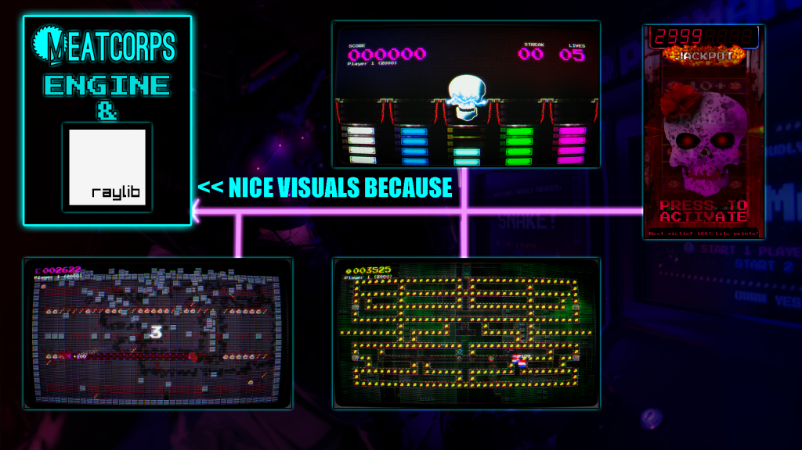

# Meatcorps.Engine – A Code-First Arcade Game Engine

[](https://github.com/meatcorps/Engine/actions/workflows/nugetpublish.yml)

(Click here for the documentation / wiki!)[https://github.com/meatcorps/Engine/wiki]

(Click here for updates on Reddit!)[https://reddit.com/r/meatcorps]

**Meatcorps.Engine** is a lightweight, code-first game framework built on top of **Raylib**.  
It’s designed for speed, clarity, and arcade-style projects — no heavy IDE tools, no scene editors, just code.



## Get started
### With template (RECOMMENDED!)
Use the following command to install the dotnet templates:

`dotnet new install Meatcorps.Engine.ProjectTemplates`

Then use gamestarter including some shaders, controller, keyboard support and more (RECOMMENDED!):

`dotnet new mcGameStarterTemplate -n YourGameName`

**OR** Really bare bone, then use the following:

`dotnet new mcBareBoneTemplate -n YourGameName`

### Without template 
Install nuget package `Meatcorps.Engine.RayLib` then use the following minimal snipped:
```csharp
using Meatcorps.Engine.Core.Modules;
using Meatcorps.Engine.Core.ObjectManager;
using Meatcorps.Engine.Core.Settings;
using Meatcorps.Engine.Core.Storage.Data;
using Meatcorps.Engine.Logging.Module;
using Meatcorps.Engine.RayLib.Abstractions;
using Meatcorps.Engine.RayLib.Modules;
using Meatcorps.Engine.RayLib.PostProcessing.Extensions;
using Meatcorps.Engine.RayLib.Resources;
using Raylib_cs;

LoggingModule.Load();
CoreModule.Load();
BasicConfig.Load();

MeatcorpsEngineLibSettings.IsDebug = true;

using var _ = RayLibModule.Setup()
    .SetTitle("Meatcorps Game Starter")
    .SetInitialSize(1920, 1080) // Turn this off when publishing the game!
    .Load(new ExampleScene())
    .Run();


public class ExampleScene : BaseScene
{
    protected override void OnInitialize()
    {
        AddGameObject(new ExampleGameObject());
    }

    protected override void OnUpdate(float deltaTime)
    {
    }

    protected override void OnDispose()
    {
    }
}

public class ExampleGameObject : BaseGameObject
{
    protected override void OnInitialize()
    {
    }

    protected override void OnUpdate(float deltaTime)
    {
    }

    protected override void OnDraw()
    {
        Raylib.DrawText("HELLO WORLD!", 32, 32, 16, Color.White);
        base.OnDraw();
    }

    protected override void OnDispose()
    {
    }
}
```

## Philosophy

- **Code First. Always.**  
  Your IDE *is* your editor. Game logic, UI, effects, input — everything is expressed in C# code.  
  No hidden metadata, no fragile scene files. The source *is* the game.  

- **Composable Building Blocks.**  
  The engine is made of small, orthogonal pieces — `BaseGameObject`, `InlineRender`, `Texture2DItem`, `RenderService`, `InputRouter`.  
  You wire them together however you like. Think “Lego bricks”, not “monolithic editor”.  

- **Arcade at Heart.**  
  Meatcorps.Engine was born for real arcade machines.  
  Big sprites, CRT shaders, crunchy audio, external controllers — it thrives on that plug-and-play retro vibe.  

- **Practical, Not Maximal.**  
  No sprawling editor UI, no “AAA-ready” features that you’ll never use.  
  What you get is what you need: rendering, input, layout, tweening, sound, and hardware hooks.  
  Enough to make it shine, nothing to slow it down.  

## Why not Unity/Unreal?
Because this isn’t a “general purpose” engine — it’s an **arcade machine engine**.  
Optimized for quick iteration, post-processing fun, and hardware integration, without the overhead of a full commercial engine.  

## Ideal Use Cases
- Arcade projects (custom cabinets, touchscreens, CRT builds).  
- Tight, focused 2D games.  
- Experiments where you want full control without editor bloat.  

---

## Core Components Overview

### `BaseScene`
- Manages a collection of `BaseGameObject`s.  
- Controls update loops: `PreUpdate`, `Update`, `AlwaysUpdate`, `LateUpdate`.  
- Integrates with `ObjectManager` for registration and lookups.  
- Supports sub-scenes and scene switching.

### `BaseGameObject`
- Core unit of gameplay and UI.  
- Lifecycle hooks: `OnInitialize`, `OnUpdate`, `OnDraw`, `OnDispose`.  
- Properties for `Position`, `Layer`, `Camera` target, and visibility.  
- Can be injected into any scene with minimal setup.

### `RenderService`
- Centralized rendering pipeline.  
- Organizes objects by scene layer and game object layer.  
- Separates **World** and **UI** rendering using camera and render targets.  
- Supports post-processing chains and pixel-perfect strategies.

### `InlineRender`
- Lightweight inline layout engine (inspired by CSS flexbox).  
- Handles wrapping, alignment (`HAlign`, `VAlign`), auto-sizing.  
- Works with text, textures, sprites, animations, and custom draw calls.  
- Perfect for HUDs, scoreboards, dialog boxes, and CRT overlays.

### `Texture2DItem<T>`
- Strongly-typed sprite atlas manager.  
- Maps enums to source rectangles in a texture.  
- Supports animation, tinting, scaling, and integration with `InlineRender`.

### `InputRouter` + `ArduinoControllerModule`
- Device-agnostic input mapping.  
- Route inputs from keyboard, gamepads, or custom arcade controllers.  
- Full support for per-button LED animations (`BlinkAnimation`, `FlashAnimation`, `AnimationChain`).  
- Player-assignable input maps for multiplayer setups.

---

## TL;DR
Meatcorps.Engine is **code-first game development** for **arcade projects**.  
Fast, modular, fun — no editor required.


## Audio policy

- Public repo includes only placeholder audio in `Assets/PlaceHolders/`.
- Actual music and sound effects are licensed and stored locally in `Assets/Music/` and `Assets/SoundFX/`.
- If missing, the engine automatically loads placeholders.
